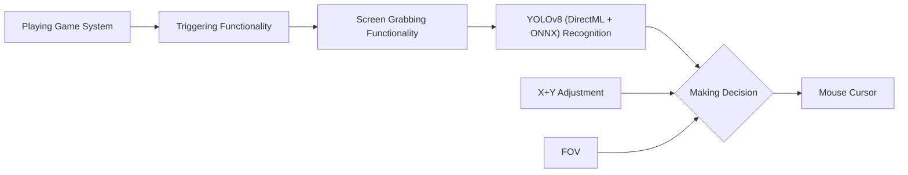

> [!NOTE]
> If you enjoy Aimly, please consider giving us a star ⭐! We appreciate it! :)

  

**Aimly** is a universal AI-Based Aim Alignment Mechanism forked from Aimmy to provide a way better experience that actually listens to the community!

Unlike most AI-Based Aim Alignment Mechanisms, Aimly utilizes DirectML, ONNX, and YOLOV8 to detect players, offering both higher accuracy and faster performance compared to other Aim Aligners, especially on AMD GPUs, which would not perform well on Aim Alignment Mechanisms that utilize TensorRT.

Aimly also provides an easy to use user-interface, a wide set of features and customizability options tailored explicitly to community requests which makes Aimly a great option for anyone who wants to use and tailor an Aim Alignment Mechanism for a specific game without having to code.

Aimly is 100% free to use. This means no ads, no key system, and no paywalled features. Aimly is not, and will never be for sale for the end user, and is considered a source-available product, **not open source** as we actively discourage other developers from making commercial forks of Aimly.

Please do not confuse Aimly as an open-source project, we are not, and we have never been one.

* **Want to connect with us?** Join our Discord Server: https://discord.gg/JWdpEb9f6Z
* **If you want to share Aimly with your friends, our website is:** https://aimly.pages.dev/

---

## Table of Contents
- [What is the purpose of Aimly?](#what-is-the-purpose-of-aimly)
- [How does Aimly Work?](#how-does-aimly-work)
- [Features](#features)
- [Setup](#setup)
- [How is Aimly better than similar AI-Based tools?](#how-is-aimly-better-than-similar-ai-based-tools)
- [How the hell is Aimly free?](#how-the-hell-is-aimly-free)
- [How do I train my own model?](#how-do-i-train-my-own-model)
- [How do I upload my model to the "Downloadable Models" menu](#how-do-i-upload-my-model-to-the-downloadable-models-menu)

---

## What is the purpose of Aimly?
### Aimly was designed for Gamers who are at a severe disadvantage over normal gamers.
### This includes but is not limited to:
- Gamers who are physically challenged
- Gamers who are mentally challenged
- Gamers who suffer from untreated/untreatable visual impairments
- Gamers who do not have access to a seperate Human-Interface Device (HID) for controlling the pointer
- Gamers trying to improve their reaction time
- Gamers with poor Hand/Eye coordination
- Gamers who perform poorly in FPS games
- Gamers who play for long periods in hot environments, causing greasy hands that make aiming difficult 

---

## How does Aimly Work?

When you press the trigger binding, Aimly will capture the screen and run the image through AI recognition powered by your computer hardware. The result it develops will be combined with any adjustment you made in the X and Y axis, and your current FOV and will result in a change in your mouse cursor position.

---

## Features
1. **Full Fledged UI**
	- Aimly provides a well designed and full-fledged UI for easy usage and game adjustment.
2. **DirectML + ONNX + YOLOv8 AI Detection Algorithm**
	- The use of these technologies allows Aimly to be one of the most accurate and fastest Aim Alignment Mechanisms out there in the world
3. **Dynamic Customizability System**
	- Aimly provides an interactive customizability system with various features that auto-updates the way Aimly will aim as you customize. From AI Confidence to FOV, Aimly makes it easy for anyone to tune their aim
4. **Dynamic Visual System**
	- Aimly contains a universal ESP system that will highlight the player detected by the AI. This is helpful for visually impaired users who have a hard time differentiating enemies, and for configuration creators attempting to debug their configurations.
5. **Mouse Movement Method**
	- Aimly grants you the right to switch between 5 Mouse Movement Methods depending on your Mouse Type and Game for better Aim Alignment
6. **Hotswappability**
	- Aimly lets you hotswap models and configurations on the go. There is no need to reset Aimly to make your changes
7. **Model and Configuration Store with Repository Support**
	- Aimly makes it easy to get any models and configurations you may ever need, and with repository support, you can get up to date with the latest models and configurations from your favorite creators

---

## Setup
- Download and Install the x64 version of [.NET Runtime 8.0.X.X](https://dotnet.microsoft.com/en-us/download/dotnet/thank-you/runtime-desktop-8.0.2-windows-x64-installer)
- Download and Install the x64 version of [Visual C++ Redistributable](https://aka.ms/vs/17/release/vc_redist.x64.exe)
- Download Aimly from [Releases](https://github.com/Mikeykorby/Aimly/releases/latest) (Make sure it's the Aimly zip and not Source zip)
- Extract the Aimly.zip file
- Run Aimly2.exe
- Choose your Model and Enjoy :)

---

## How is Aimly better than similar AI-Based tools?
Aimly is written in C# using .NET 8 and WPF utilizing pre-existing libraries like DirectML and ONNX. This has allowed us to make a very fast Aim Aligner with high compatiblity on both AMD and NVIDIA GPUs without sacrificing the end-user experience.

  

Beyond the core functionality, Aimly also adds some amazing additional features like Detection ESP to help you tune your gaming experience however you like it.

Aimly comes pre-bundled with a well trained AI model with thousands of images. 

Besides that model, Aimly provides dozens of other community made models through the store and our Discord server, with more models being developed every day by other Aimly users. These models vary from game to image count, making Aimly incredibly versatile and universal for thousands of games on the market right now.

---

## How the hell is Aimly free?
As an AI based Aim Aligner, Aimly does not require any sort of upkeep because it does not read any specific game data to perform it's actions. If Aimly team stops maintaining Aimly, even if no one pitches in to fork and maintain the project, Aimly would still work.

This has meant that while we do currently use out of pocket expenses to run Aimly, those expenses have been low enough that it hasn't been a necessity for Aimly to run on even an ad-supported model.

We do not seek to make money from Aimly, we only seek your kind words <3, and a chance to help people aim better, by assisting their aim or even to train how they aim (yes, you can use Aimly in that way too)

---

## How do I train my own model
Please see the video tutorial below on how to label images and train your own model. (Redirects to Youtube)

---

## How do I upload my model to the "Downloadable Models" menu?
Please read the tutorial at [UploadModel.md](ModelUpload.md)
