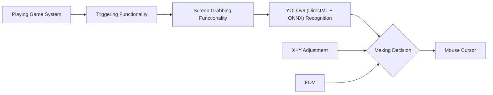

> [!NOTE]
> If you enjoy Aimly, please consider giving us a star ⭐! We appreciate it! :)

  

**Aimly** is a universal AI-Based Aim Alignment Mechanism forked from Aimmy to provide a way better experience that actually listens to the community!

Unlike most AI-Based Aim Alignment Mechanisms, Aimly utilizes DirectML, ONNX, and YOLOv8 to detect players. This offers both higher accuracy and faster performance compared to other Aim Aligners—especially on AMD GPUs, which traditionally underperform on mechanisms utilizing TensorRT.

Aimly also provides an easy-to-use user interface, a wide set of features, and customizability options tailored explicitly to community requests. This makes Aimly a great option for anyone who wants to use and tailor an Aim Alignment Mechanism for a specific game without having to code.

Aimly is **100% free to use**. This means no ads, no key system, and no paywalled features. Aimly is not, and will never be, for sale for the end user. It is considered a source-available product, **not open source**, as we actively discourage other developers from making commercial forks of Aimly. 

*Please do not confuse Aimly as an open-source project; we are not, and we have never been one.*

* **Discord:** [Join our Server](https://discord.gg/aimmy)
* **Website:** [aimmy.dev](https://aimmy.dev/)

---

## Table of Contents
- [What is the purpose of Aimly?](#what-is-the-purpose-of-aimly)
- [How does Aimly Work?](#how-does-aimly-work)
- [Features](#features)
- [Setup](#setup)
- [How is Aimly better than similar AI-Based tools?](#how-is-aimly-better-than-similar-ai-based-tools)
- [How the hell is Aimly free?](#how-the-hell-is-aimly-free)
- [How do I train my own model?](#how-do-i-train-my-own-model)
- [How do I upload my model?](#how-do-i-upload-my-model-to-the-downloadable-models-menu)

---

## What is the purpose of Aimly?

Aimly was designed for gamers who are at a severe disadvantage over normal gamers. This includes, but is not limited to:

* Gamers who are physically challenged.
* Gamers who are mentally challenged.
* Gamers who suffer from untreated/untreatable visual impairments.
* Gamers who do not have access to a separate Human-Interface Device (HID) for controlling the pointer.
* Gamers trying to improve their reaction time.
* Gamers with poor hand/eye coordination.
* Gamers who perform poorly in FPS games.
* Gamers who play for long periods in hot environments, causing greasy hands that make aiming difficult.

---

## How does Aimly Work?

When you press the trigger binding, Aimly captures the screen and runs the image through AI recognition powered by your computer hardware. The resulting decision is combined with any adjustments you made to the X and Y axis, alongside your current FOV, resulting in a direct change to your mouse cursor position.

Features
Full-Fledged UI: Aimly provides a well-designed and comprehensive UI for easy usage and game adjustment.

DirectML + ONNX + YOLOv8 AI Detection: The use of these technologies allows Aimly to be one of the most accurate and fastest Aim Alignment Mechanisms in the world.

Dynamic Customizability System: Aimly provides an interactive customizability system. From AI Confidence to FOV, it auto-updates the way Aimly aims as you tweak the settings.

Dynamic Visual System: Includes a universal ESP system that highlights the player detected by the AI. This is incredibly helpful for visually impaired users and configuration creators debugging their setups.

Mouse Movement Methods: Switch between 5 different mouse movement methods depending on your hardware and the game for optimal aim alignment.

Hotswappability: Seamlessly hotswap models and configurations on the go without needing to restart or reset Aimly.

Model and Configuration Store: Built-in repository support makes it easy to download models and configurations from your favorite creators.

Setup
Download and install the x64 version of .NET Runtime 8.0.X.X.

Download and install the x64 version of Visual C++ Redistributable.

Download Aimly from the Releases Page (Make sure to download the Aimly zip, not the Source zip).

Extract the Aimly.zip file.

Run Aimly2.exe.

Choose your Model and enjoy! :)

How is Aimly better than similar AI-Based tools?
Aimly is written in C# using .NET 8 and WPF, utilizing pre-existing libraries like DirectML and ONNX. This allows us to provide a highly responsive Aim Aligner with excellent compatibility across both AMD and NVIDIA GPUs without sacrificing the end-user experience.

Beyond the core functionality, Aimly adds amazing additional features like Detection ESP to help you perfectly tune your gaming experience.

Aimly comes pre-bundled with a well-trained AI model trained on thousands of images. Besides the default model, Aimly provides dozens of community-made models through the store and our Discord server. Because models vary from game to game, Aimly remains incredibly versatile for thousands of titles on the market.

How the hell is Aimly free?
As an AI-based Aim Aligner, Aimly does not require server upkeep because it processes data locally and does not read specific game data to perform its actions. If the team stops maintaining Aimly—even if no one pitches in to fork it—the software will continue to work.

While we use out-of-pocket expenses to keep things running, those costs remain low enough that we do not need to rely on an ad-supported model. We do not seek to make money from Aimly; we only seek your kind words and the chance to help people improve their aim.

How do I train my own model?
Check out the video tutorial below on how to label images and train your own YOLOv8 model.

How do I upload my model to the "Downloadable Models" menu?
Please read the full model upload tutorial here: UploadModel.md
